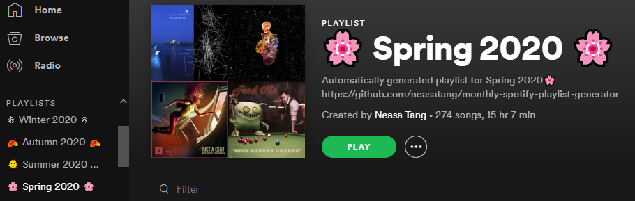

# monthly-spotify-playlist-generator

Generates seasonal playlists that you may want to create from a big playlist that you have over the years

## Setup 
Some environment variables required to run the script:
| Key                   | Val                            | 
| --------------------- | ------------------------------:|
| SPOTIPY_CLIENT_ID     | spotify client ID              |
| SPOTIPY_CLIENT_SECRET | spotify client secret          |
| SPOTIPY_REDIRECT_URI  | spotify redirect uri           |
| PLAYLIST_ID           | big playlist that you have     |
| USER_ID               | user id that owns the playlist |

## Different scripts
* most-recent-montly-spotify-playlist-generator.py 
    * generates the playlist for the last season
* montly-spotify-playlist-generator.py 
    * generates the playlist for all the past seasons
   
